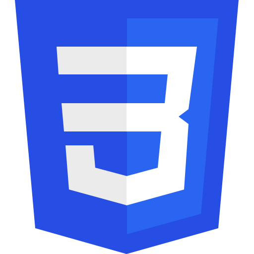

# CTEC3905 MODULE HANDBOOK

| HTML | CSS | Javascript |
|:----:|:---:|:----------:|
|  |  |  |

## Contents
- [Learning outcomes](#learning-outcomes)
- [Staff](#staff)
- [Module structure](#module-structure)
  - [Online materials](#online-materials)
  - [Labs](#labs)
  - [Additional online workshops](#additional-online-workshops)
  - [Calendar](#calendar)
- [Assignment](#the-assignment)
  - [Deliverable](#deliverable)
  - [Submission](#submission)
  - [Marking Criteria](#marking-criteria)
  - [Further general advice on your project](#further-general-advice-on-your-project)
- [Key resources](#key-resources)
  - [Blackboard](#blackboard)
  - [Github](#github)
  - [Software](#software)
   - [Desktop web browsers](#desktop-web-browsers)
   - [Programmers text editor](#programmers-text-editor)
   - [Version control](#version-control)
 - [Books and websites](#books-and-websites)
 - [Online resources and tutorials](#online-resources-and-tutorials)
- [Extensions and late submission](#extensions-and-late-submission)
- [Deferrals, failure and reassessment](#deferrals-failure-and-reassessment)
- [Academic Offences and Bad Academic Practices](#academic-offences-and-bad-academic-practices)

## Learning outcomes

By the end of this module, through completion of asynchronous materials and lab exercises, you will be able to:

1.	Use GIT and GitHub for version control and code storage
2.	Demonstrate critical understanding of Information Architecture, user interface design, usability principles and semantic markup
3.	Demonstrate detailed understanding of all three current front-end web technologies, their use and context
4.	Create a fully standards-compliant, responsive and accessible website or web-technology-based application

In addition, best practice in general software development (e.g. regular version control of the final project code, consistent code indentation, consistent file and folder naming, etc.) will be encouraged throughout the module. These will also be part of the marking criteria for the final project.

## Staff

- **Graeme Stuart** (module leader): gstuart@dmu.ac.uk
- **Salimah Mohamed**: salimah.mohamed@dmu.ac.uk
- **Dave Everitt**: guest lecturer

**Please note:** teaching staff contact outside timetabled hours is strictly via email.
Please contact module leader for module enquiries.

## Module structure

This year, the module runs from week 17 (25th January) to week 30 (30th April). The final project hand-in date is: Midday on Friday 30th April 2021 (week 30) via the link under [Assessment on Blackboard](https://vle.dmu.ac.uk/webapps/blackboard/content/listContent.jsp?content_id=_4247904_1&course_id=_551514_1&mode=reset).

### Online materials

Each week, online resources and video demonstrations will introduce the learning materials in preparation for a related lab session the following week (see timetable).
Asynchronous content will be released on the Thursday prior to lab sessions the following week.

These resources provide essential technical information as well as wider perspectives on front-end web technologies.
They also contain carefully-selected links for further information.

It is essential that the main material is completed before the following lab session.
You must view/read the provided content **before** your first lab each week.

### Labs

There are a total of ten two-hour online labs and four one-hour face-to-face labs.

Labs involve guided exercises and hands-on coding.
They are a focussed place to work on your final assignment and develop your skills.
This is a very concentrated module, covering the three languages HTML5, CSS3 and JavaScript ES6.
Completing all the lab exercises will ensure that your knowledge keeps pace with the module calendar.
The last few labs (after Easter in particular) will focus on practical advice and questions supporting your individual assignment work.

Each week there will be a 2-hour timetabled lab session held online in blackboard collaborate in groups of 60.
Face-to-face lab sessions will be spread over the 10-week period and will be in small groups of 11.
If necessary, face-to-face labs will be moved online.
Depending on which group you are in, these will be in weeks 17, 21, 25 and 29 or weeks 18, 21, 24 and 30.
For specific class times and locations, check your personal timetable.

### Additional online workshops

This year we will also have three online workshops (weeks 18, 21 and 24) with guest lecturer (and CTEC3905 module co-founder) Dave Everitt from the media school.

### Calendar

| Week | Content available | Indicative content |
| :--: | :---------------: | ------------------ |
| 17 | 21 Jan | Module introduction. Introduction to HTML. Workflow. |
| 18 | 28 Jan | Introduction to CSS. Creating and styling a page. Web design and Usability. |
| 19 | 04 Feb | Introduction to JavaScript. Using GIT and github. |
| 20 | 11 Feb | Mobile-first, responsive web design. |
| 21 | 18 Feb | Getting user input. Planning for real users. |
| 22 | BREAK | content for week 23 released in advance |
| 23 | 25 Feb | Manipulating the DOM. JSON data and storage APIs. |
| 24 | 11 Mar | Getting remote JSON data from APIs. The web's roots and future. |
| 25 | 18 Mar | CSS animation and transition. |
| 26 | EASTER | content for week 29 released in advance |
| 27 | EASTER | work on assignment |
| 28 | EASTER | develop your questions for the final few lab sessions |
| 29 | 25 Mar | Assignment workshops. Final project development, how to hand in, final look at marking criteria (released before Easter) |
| 30 | 26 Apr | Assignment workshops. ASSIGNMENT DUE 30th April @ 12:00 |

## The assignment

You will create a website of no more than 4 separate pages (4 distinct screen sections for Single-Page Apps) on a topic of your choice (e.g. portfolio, business, interests, game reviews…). This can be useful for your future and should demonstrate your knowledge of all three front-end languages.

- **Weighting:** 100% of module mark
- **Deadline:** midday Friday 30th April 2021 (week 30)
- **Feedback:** by midday Wednesday 2nd June 2021 (week 35)
- **Submission:** URL for your GitHub classroom repository to the [Assignment submission link on Blackboard](https://vle.dmu.ac.uk/webapps/assignment/uploadAssignment?content_id=_4516063_1&course_id=_551514_1&group_id=&mode=cpview)

### Deliverable

A private github classroom repository will be created for you within the [CTEC3905 github organisation](https://github.com/ctec3905-2020-21).
This repository will be visible to you and the module tutors.
It is the only way we can see your code and will ultimately be used for the submission so take good care of it.
Instructions for cloning the repository will be provided, this will give you a basic template for your assignment.

Over the course of the module, you are encouraged to gradually replace the template with your own evolving code.
You will be expected to update your code regularly and also to keep the submission repository up-to-date with regular pushes.
A good guide would be to make a minimum of two or three commits per week, starting as early as possible and running through to the submission date.
This allows the project team to inspect your code and offer advice but also ensures you generate a commit history commensurate with the marking criteria.

Note that the deliverable is not simply your final code but the entire history of your development process captured in the git repository.
It is important that we see your code evolve from a basic first draft through to the final submission.
Redesigning and refactoring is part of the process, we expect to see changes in markup and redesigns of styles as we introduce new concepts.
So don't be afraid to commit early and commit often.

### Submission

The submission repository URL should be entered via the [Assignment submission link on Blackboard](https://vle.dmu.ac.uk/webapps/assignment/uploadAssignment?content_id=_4516063_1&course_id=_551514_1&group_id=&mode=cpview) before the assignment deadline (30th April, midday).

Please make sure you **double-check your code repository URL before submitting**.

**Feedback:** will be given on work in progress during workshop sessions and in written form via the marking rubric for the final assignment, within 20 working days of the deadline.

**Reminder**: all marks are provisional, subject to moderation, and will be ratified by the June Progress and Awards Board.

If you need any support or advice on completing this coursework please visit the Student Matters tab on the Faculty of Technology Blackboard page.

### Marking criteria

These come under four headings:

1. HTML and CSS Code Quality
2. JavaScript, APIs & JSON
3. Responsiveness, Accessibility and Interaction
4. GIT Version Control

Please ensure you understand all the requirements under each heading - see the full marking criteria under [Assessment on Blackboard](https://vle.dmu.ac.uk/webapps/blackboard/content/listContent.jsp?course_id=_551514_1&content_id=_4247904_1&mode=reset).

### Anonymous marking

Because of the practical nature of this module, there will be no anonymous marking as the origin of each students’ work is obvious to the tutors from workshop sessions.

### Further general advice on your project

- is all code indented consistently?
- is all HTML and CSS code validated?
- is there a good page structure with HTML5 semantic tags?
- is the navigation effective or is some content hard to find?
- is the site fully responsive at all sizes?
- is all JavaScript (.js) and CSS (.css) in separate files?
- are all file names lower-case?
- are images in a separate folder?
- are there any Javascript errors in the console?

## Key resources

### Blackboard

**Blackboard** is the central point of reference for this module, these are the main sections:

- **Announcements:** Weekly communication and important additional reminders
- **Staff contacts:** module leader and teaching staff
- **Module handbook:** this document, including module calendar
- **Resource list:** the official resource list for the module
- **Software:** links to download and install Atom, Google Chrome and Git
- **Learning materials:** primary learning resources, including:
  - Pre-recorded videos released each week
  - links to slides
  - recommended books, articles and tutorials
- **Online lab material:** Lab exercises released each week, in advance
- **Online classroom**: links for attending online sessions
- **Assignment:** assignment brief, marking scheme and submission link

### Github

We have created a [CTEC3905 github organisation](https://github.com/ctec3905-2020-21) for the code examples and slides. Please become familiar with this as it is also used for assignment submission (see below).

### Software

#### Desktop web browsers

- [Chrome](https://www.google.com/chrome/) (recommended for module learning material)
- [Firefox](https://www.mozilla.org/en-US/firefox/)

The following are also usable, but not advised for the module:

- [Edge](https://www.microsoft.com/en-gb/windows/microsoft-edge)
- [Safari](https://www.apple.com/safari/)

**Do not use Internet Explorer**, which may be the default on lab machines. If it opens, just close it down and use Chrome to view your HTML files.

The [main default mobile browsers](http://gs.statcounter.com/browser-market-share/mobile/worldwide) are fine for previewing work, too.

#### Programmers text editor

For your own laptop or personal computer, you will need a good programming text editor.
These are free, and good:

- [Atom](https://atom.io/) (recommended for module learning material)
- [VSCode](https://code.visualstudio.com/)
- [Brackets](http://brackets.io/)

#### Version control

We will use GIT for version control and code sharing.
GIT can be used via a command line and/or via text editor integration.
All the above editors have integrated GIT management, either natively or via a plugin.
You will need to [download GIT](https://git-scm.com/downloads) and install it in either case.

We will be using no more than a handful of GIT commands **from the command-line** throughout the module.
It is also possible to use GIT via one of the desktop GUI interfaces but we will **not** be covering that in this module.

### Books and websites

These two books have been core texts for web developers:

- Ethan Marcotte, [**Responsive Web Design**](https://abookapart.com/products/responsive-web-design) (2014)
- Luke Wroblewski, [**Mobile First**](https://abookapart.com/products/mobile-first) (2011)

Although they were published a few years ago, they are regarded as game-changers and are still relevant in 2021.

Two further HTML5 and CSS3 books are also useful:

- Dan Cederholm, [**CSS3 for Web Designers**](https://abookapart.com/products/css3-for-web-designers) (2nd Ed, 2015)
- Jeremy Keith & Rachel Andrew, [**HTML5 for Web Designers**](https://abookapart.com/products/html5-for-web-designers) (2nd Ed, 2016)

There's also a free Udacity course - [Responsive Web Design Basics](https://developers.google.com/web/fundamentals/design-and-ux/responsive/) - from Google developers.

Two free online JavaScript books are useful references:

- Marijn Haverbeke, [**Eloquent JavaScript**](https://eloquentjavascript.net)
- Dr. Axel Rauschmayer, [**Exploring ES6**](http://exploringjs.com/es6/index.html)

You won’t need to read these in detail for the module, but if you want to dig deeper into JavaScript, they cover far more than the module learning materials can.

### Online resources and tutorials

The module recommends only two online reference sites:

- Mozilla Developer Network (MDN): [HTML](https://developer.mozilla.org/en-US/docs/Web/HTML), [CSS](https://developer.mozilla.org/en-US/docs/Web/CSS), [JavaScript](https://developer.mozilla.org/en-US/docs/Web/JavaScript)
- W3Schools references: [HTML](https://www.w3schools.com/tags/), [CSS](https://www.w3schools.com/cssref/), [JavaScript](https://www.w3schools.com/jsref/)

MDN is more up-to-date, accurate and technical, though it does still include older syntax (such as use of `var`) in some examples.
Curent best practice (as covered in the learning materials and reflected in the marking criteria) is to replace all uses of `var` with `let` or `const`.

W3Schools is good for quick reference although some examples use *inline* JavaScript (e.g. `onclick`).
Current best practice (as covered in the learning materials and reflected in the marking criteria) is to use the [JavaScript eventListener](https://developer.mozilla.org/en-US/docs/Web/API/EventTarget/addEventListener).

You can [validate HTML](https://validator.w3.org/) and [validate CCS](https://jigsaw.w3.org/css-validator/) online, and a good text editor will also highlight syntax errors.

Finally, [Can I Use](https://caniuse.com/) is indispensable for checking browser support for newer and emerging code features.
However, almost all code taught on the module is supported by modern browsers.

## Extensions and late submission

### Extensions
These may be granted only for significant reasons (e.g. chronic health issues, *serious* family problems, etc.) They **cannot** be granted for bad time management, holidays, pressure from other module deadlines, minor illnesses or accidents, clashing appointments, etc. [Your request for an extension must meet the criteria set out by the university](https://dmu.ac.uk/dmu-students/the-student-gateway/academic-support-office/deferral-of-assessments.aspx) where acceptable and unacceptable conditions are listed under "What are extenuating circumstances?".

### Late submission of coursework policy

Late submissions will be processed in accordance with current University regulations which state:

> “the time period during which a student may submit a piece of work late without authorisation and have the work capped at 40% [50% at PG level] if passed is **14 calendar days**. Work submitted unauthorised more than 14 calendar days after the original submission date will receive a mark of 0%. These regulations apply to a student’s first attempt at coursework. Work submitted late without authorisation which constitutes reassessment of a previously failed piece of coursework will always receive a mark of 0%.”

These rules also apply to work submitted after an agreed *14-day extension deadline* authorised by the Module Tutor or Leader.

## Deferrals, failure and reassessment

In very exceptional circumstances, a deferral may be granted.

If you are judged to have failed the course, contact the module leader or workshop tutor as soon as possible for advice on how to resubmit for reassessment.

## Academic Offences and Bad Academic Practices

These include plagiarism, cheating, collusion, copying work and reuse of your own work, poor referencing or the passing off of somebody else’s ideas as your own. If you are in any doubt about what constitutes an academic offence or bad academic practice you must check with your tutor. Further information and details of how DSU can support you, if needed, is available at the following DMU web pages:

- [Academic offences](http://www.dmu.ac.uk/dmu-students/the-student-gateway/academic-support-office/academic-offences.aspx)
- [Bad academic practice](http://www.dmu.ac.uk/dmu-students/the-student-gateway/academic-support-office/bad-academic-practice.aspx)

### Plagiarism (using work from other sources)

Read the DMU library page [“What is plagiarism”](http://www.library.dmu.ac.uk/Support/Justask/index.php?page=175&faqcategory=14#f1). As for copying code, developers often examine source code from other sites and adapt features they like into their own work. However, pre–designed templates of complete designs, copying “build a website” tutorials without significant modification, or taking code wholly or substantially from other sources is not acceptable, as you will learn very little.

Please include specific references in your GitHub `readme.md` file for any third-party code or online tutorials you have adapted.

However, the practical work submitted for this course **must primarily be your own**, so be aware that tutors will check source code in detail.

**For further information**, please refer to the [student regulations on the DMU website](http://www.dmu.ac.uk/dmu-students/the-student-gateway/academic-support-office/student-regulations.aspx).
